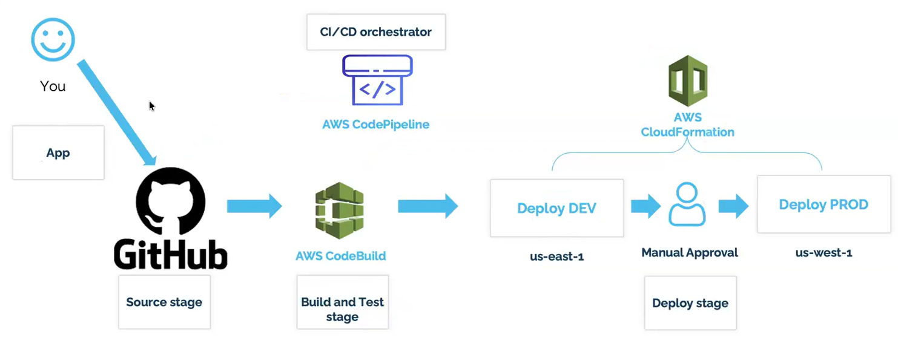
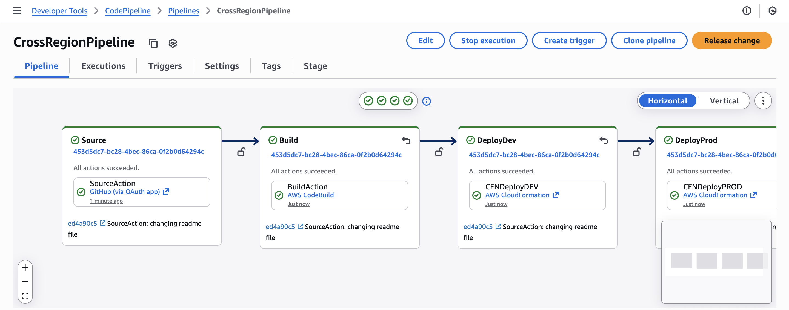
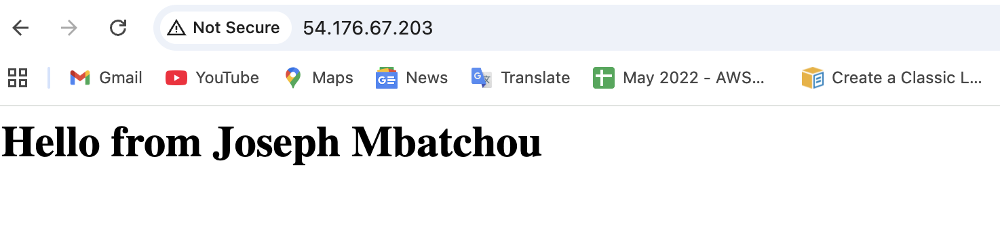

# CFN-3STAGES-PIPELINE

A **3‑stage CI/CD pipeline** built with AWS native services (CodePipeline, CodeBuild, CloudFormation) that deploys a highly available EC2‑based web application across **two AWS regions** (`us-west-2` – Dev, `us-west-1` – Prod). The pipeline is triggered by GitHub commits and uses Infrastructure as Code (IaC) to ensure consistent, repeatable deployments.

---

## 📋 Table of Contents

- [Architecture](#-architecture)
- [Features](#-features)
- [Prerequisites](#-prerequisites)
- [Repository Structure](#-repository-structure)
- [Setup & Deployment](#-setup--deployment)
  - [1. Clone the Repository](#1-clone-the-repository)
  - [2. Create S3 Artifact Buckets](#2-create-s3-artifact-buckets)
  - [3. Create EC2 Key Pairs](#3-create-ec2-key-pairs)
  - [4. Generate a GitHub Personal Access Token](#4-generate-a-github-personal-access-token)
  - [5. Deploy the Pipeline Stack](#5-deploy-the-pipeline-stack)
- [Pipeline Execution](#-pipeline-execution)
- [Cleanup](#-cleanup)
- [Troubleshooting](#-troubleshooting)
- [Contributing](#-contributing)
- [License](#-license)

---

## 🏗 Architecture

  


The pipeline consists of three stages:

1. **Source** – GitHub repository (via OAuth token).  
2. **Build** – AWS CodeBuild validates the CloudFormation template.  
3. **Deploy** – Two parallel (or sequential) CloudFormation deployments:
   - `us-west-2` – Development stack (`DevStack`)  
   - `us-west-1` – Production stack (`ProdStack`)

**Artifact stores** are located in each region, ensuring low‑latency access to build outputs.

---

## ✨ Features

- **Cross‑region deployments** – Single pipeline managing multiple regions.  
- **Immutable infrastructure** – Every change goes through the same CI/CD process.  
- **Security** – IAM roles follow least‑privilege (customizable).  
- **Validation** – CloudFormation template linting/validation in the build stage.  
- **Parameterization** – GitHub repo details and EC2 key name are passed as parameters.  
- **Cost‑efficient** – S3 artifact buckets with lifecycle policies recommended.

---

## ✅ Prerequisites

- An **AWS account** with sufficient permissions (AdministratorAccess or equivalent).  
- **AWS CLI** installed and configured (`aws configure`).  
- A **GitHub account** and a **personal access token** (classic) with `repo` scope.  
- An **EC2 key pair** created in **both** `us-west-2` **and** `us-west-1` with the **same name**.  
- Two **globally unique S3 buckets** (one in each region) for pipeline artifacts.  

---

## 📁 Repository Structure

```
CFN-3STAGES-PIPELINE/
├── infrastructure/
│      └── ec2-stack.yaml.      # CloudFormation template for EC2 + VPC
│
├── pipeline/        
│      └── pipeline.yml          # Main pipeline CloudFormation template
│                           
├── scripts/                     # Helper scripts
│      └── deploy-pipeline.sh 
│      └── cleanup.sh        
│
├── images/                      # Architecture diagrams
│      └── architecture.png
│
├── buildspec.yml                # CodeBuild instructions 
│
└── README.md
```


## 🚀 Setup & Deployment

### 1. Clone the Repository

```bash
git clone https://github.com/Joebaho/CFN-3STAGES-PIPELINE.git
cd CFN-3STAGES-PIPELINE
```

### 2. Create S3 Artifact Buckets

Artifact bucket names must be globally unique. Replace YOUR_ACCOUNT_ID with your actual AWS account ID:

```bash
# us-west-2 (Dev)
aws s3 mb s3://pipeline-artifacts-${YOUR_ACCOUNT_ID}-west2 --region us-west-2
```

```bash
# us-west-1 (Prod)
aws s3 mb s3://pipeline-artifacts-${YOUR_ACCOUNT_ID}-west1 --region us-west-1
```

## 3. Create EC2 Key Pairs

Create a key pair with the same name in both regions (e.g., pipeline-key):

```bash
KEY_NAME="pipeline-key"

# us-west-2
aws ec2 create-key-pair --key-name $KEY_NAME --region us-west-2 --query KeyMaterial --output text > ${KEY_NAME}-west2.pem
chmod 400 ${KEY_NAME}-west2.pem

# us-west-1
aws ec2 create-key-pair --key-name $KEY_NAME --region us-west-1 --query KeyMaterial --output text > ${KEY_NAME}-west1.pem
chmod 400 ${KEY_NAME}-west1.pem
```

Store the .pem files securely – they are required to SSH into the instances.

## 4. Generate a GitHub Personal Access Token

Go to GitHub Settings → Developer settings → Personal access tokens → Tokens (classic).

Click Generate new token (classic).

Select repo scope (full control of private repositories).

Copy the token immediately – it will not be shown again.

## 5. Deploy the Pipeline Stack
Deploy the pipeline CloudFormation stack in the primary region (e.g., us-west-2):

```bash
aws cloudformation create-stack \
  --stack-name CrossRegionPipelineStack \
  --template-body file://pipeline/pipeline.yml \
  --parameters \
    ParameterKey=GitHubOwner,ParameterValue=Joebaho \
    ParameterKey=GitHubRepo,ParameterValue=CFN-3STAGES-PIPELINE \
    ParameterKey=GitHubBranch,ParameterValue=main \
    ParameterKey=GitHubToken,ParameterValue=YOUR_GITHUB_TOKEN \
    ParameterKey=KeyName,ParameterValue=pipeline-key \
  --capabilities CAPABILITY_IAM \
  --region us-west-2
Wait for the stack creation to complete:
```

```bash
aws cloudformation wait stack-create-complete --stack-name CrossRegionPipelineStack --region us-west-2
```

Once successful, the pipeline is live and will automatically start with the latest commit from your repository.

### ▶️ Pipeline Execution

The pipeline is triggered automatically on every push to the configured branch (main by default).

Manual trigger: You can also release a change via the AWS CodePipeline console.

Monitor the pipeline in the AWS Console (CodePipeline → CrossRegionPipeline).

  

## Expected outcome:

Two CloudFormation stacks (DevStack in us-west-2, ProdStack in us-west-1) are created/updated.

Each stack deploys a VPC, public subnet, security group, and an EC2 instance running Apache.

The instance displays "Hello from <YourName>" (customizable via the MyName parameter in ec2-stack.yaml).

Get the public IP of the Dev instance:

```bash
aws cloudformation describe-stacks --stack-name DevStack --region us-west-2 --query "Stacks[0].Outputs[?OutputKey=='PublicIP'].OutputValue" --output text
```

Open http://<PUBLIC_IP> in your browser to see the welcome page.

  

## 🧹 Cleanup

To avoid ongoing charges, destroy all resources in reverse order:

Delete the pipeline stack – this also deletes the CodePipeline and CodeBuild project:

```bash
aws cloudformation delete-stack --stack-name CrossRegionPipelineStack --region us-west-2
aws cloudformation wait stack-delete-complete --stack-name CrossRegionPipelineStack --region us-west-2
```

Delete the application stacks (if they weren't automatically deleted by the pipeline):

```bash
aws cloudformation delete-stack --stack-name DevStack --region us-west-2
aws cloudformation delete-stack --stack-name ProdStack --region us-west-1
```

Delete S3 artifact buckets (after ensuring no pipeline is using them):

```bash
aws s3 rb s3://pipeline-artifacts-${YOUR_ACCOUNT_ID}-west2 --force
aws s3 rb s3://pipeline-artifacts-${YOUR_ACCOUNT_ID}-west1 --force
```

Delete EC2 key pairs (optional):

```bash
aws ec2 delete-key-pair --key-name pipeline-key --region us-west-2
aws ec2 delete-key-pair --key-name pipeline-key --region us-west-1
```

## 🤝 Contributing

Contributions are welcome!

Fork the repository.

Create a feature branch (git checkout -b feature/amazing-feature).

Commit your changes (git commit -m 'Add some amazing feature').

Push to the branch (git push origin feature/amazing-feature).

Open a Pull Request.

## 👨‍💻 Author

**Joseph Mbatchou**

• DevOps / Cloud / Platform  Engineer   
• Content Creator / AWS Builder

## 🔗 Connect With Me

🌐 Website: [https://platform.joebahocloud.com](https://platform.joebahocloud.com)

💼 LinkedIn: [https://www.linkedin.com/in/josephmbatchou/](https://www.linkedin.com/in/josephmbatchou/)

🐦 X/Twitter: [https://www.twitter.com/Joebaho237](https://www.twitter.com/Joebaho237)

▶️ YouTube: [https://www.youtube.com/@josephmbatchou5596](https://www.youtube.com/@josephmbatchou5596)

🔗 Github: [https://github.com/Joebaho](https://github.com/Joebaho)

📦 Dockerhub: [https://hub.docker.com/u/joebaho2](https://hub.docker.com/u/joebaho2)

---

## 📄 License

This project is licensed under the MIT License — see the LICENSE file for details.